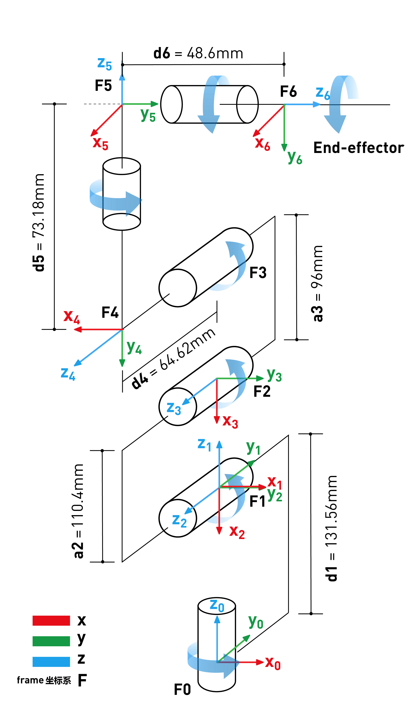
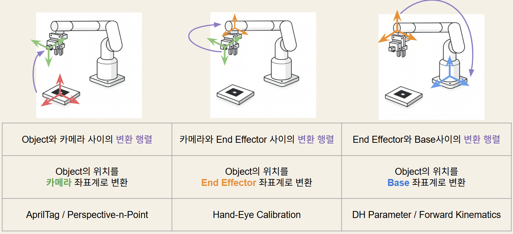

mycobot280 - pick and place with ROS2

Detect AprilTags using the camera mounted on the robot arm.

# Solve PnP를 이용하여 카메라 좌표계에서 태그의 위치를 계산
`solvePnP`는 OpenCV 라이브러리에서 제공하는 함수로, 3D 객체의 좌표와 2D 이미지 상의 대응점을 이용하여 카메라의 위치와 방향을 계산하는 알고리즘이다. 

solvePnP는 다음과 같은 입력을 필요로 한다:
- 3D 객체의 좌표 (object points): 실제 세계에서의 3D
- 2D 이미지 상의 대응점 (image points): 카메라 이미지에서의 2D 좌표
- 카메라 행렬 (camera matrix): 카메라의 내부 파라미터를 나타내는 행렬
- 왜곡 계수 (distortion coefficients): 카메라 렌즈의 왜곡

solvePnP는 다음과 같은 출력을 제공한다:
- 회전 벡터 (rotation vector): 카메라의 회전 정보를 나타내는 벡터
- 이동 벡터 (translation vector): 카메라의 이동 정보를 나타내는 벡터

이 정보를 이용하여 카메라 좌표계에서 태그의 위치를 계산할 수 있다. 회전 벡터와 이동 벡터를 사용하여 태그의 위치를 3D 공간에서 표현할 수 있으며, 이를 통해 로봇이 태그를 인식하고 상호작용할 수 있게 된다.

```python
import cv2
retval, rvec, tvec = cv2.solvePnP(objectPoints, imagePoints, cameraMatrix, distCoeffs)
```

> 참고: AprilTags를 사용할 때 solvePnP 함수가 명시적으로 호출되지 않은 이유는 AprilTags 라이브러리가 내부적으로 solvePnP 알고리즘을 사용하여 태그의 위치를 계산하기 때문이다. 


# Foward Kinematics와 DH Parameters
DH Parameters (Denavit-Hartenberg Parameters)는 로봇의 각 관절과 링크의 기하학적 관계를 나타내는 표준화된 방법이다. DH Parameters는 로봇의 각 관절에 대해 네 가지 매개변수를 정의한다:
- θ (theta): 관절의 회전 각도
- d: 관절의 이동 거리
- a: 링크의 길이
- α (alpha): 링크의 꼬임 각도

```python
d_vals     = [131.22, 0,     0,    63.4, 75.05, 45.6]
a_vals     = [0,     -110.4, -96,   0,    0,     0]
alpha_vals = [1.5708, 0,     0,    1.5708, -1.5708, 0]
offsets    = [0,     -1.5708, 0,  -1.5708, 1.5708, 0]
```

<!--  -->

**Forward Kinematics는 로봇의 관절 각도와 링크 길이를 이용하여 로봇의 End-Effector의 위치와 방향을 계산하는 과정이다.** DH Parameters를 사용하여 각 관절과 링크의 변환 행렬을 계산하고, 이를 곱하여 최종적으로 End-Effector의 위치와 방향을 얻을 수 있다.

Forward Kinematics를 계산하는 일반적인 과정은 다음과 같다:
1. 각 관절에 대한 DH Parameters를 정의한다.
2. 각 관절에 대한 변환 행렬을 계산한다.
3. 모든 관절의 변환 행렬을 곱하여 최종적으로 End-Effector의 위치와 방향을 계산한다.

# Hand-Eye Calibration
Hand-Eye Calibration은 로봇의 End-Effector와 카메라 사이의 변환 관계를 계산하는 과정이다. 이 과정은 로봇이 카메라를 통해 관측한 물체의 위치를 정확하게 파악할 수 있도록 하는 데 중요하다.

Hand-Eye Calibration을 수행하기 위해서는 다음과 같은 단계가 필요하다:
1. 로봇의 End-Effector와 카메라가 동시에 관측할 수 있는 여러 위치에서 데이터를 수집한다.
2. 각 위치에서 로봇의 End-Effector의 위치와 카메라가 관측한 물체의 위치를 기록한다.
3. 수집된 데이터를 이용하여 End-Effector와 카메라 사이의 변환 행렬을 계산한다.

Hand-Eye Calibration을 통해 얻은 변환 행렬을 사용하여 로봇이 카메라를 통해 관측한 물체의 위치를 정확하게 파악할 수 있으며, 이를 통해 로봇이 물체를 효과적으로 조작할 수 있게 된다.

이를 위해 OpenCV의 'calibrateHandEye' 함수를 사용했다. 이 함수는 로봇의 End-Effector와 카메라 사이의 변환 행렬을 계산하는 데 사용된다.

```python
import cv2

R_cam2gripper, t_cam2gripper = cv2.calibrateHandEye(
    R_gripper2base,  # 그리퍼→베이스 회전 행렬 리스트
    t_gripper2base,  # 그리퍼→베이스 평행이동 벡터 리스트
    R_target2cam,    # 타겟→카메라 회전 행렬 리스트
    t_target2cam,    # 타겟→카메라 평행이동 벡터 리스트
    method=cv2.CALIB_HAND_EYE_PARK
)
```

<br>

$$AX = XB$$
- A: 로봇 End-Effector의 이전 위치 대비 현재 위치의 변환 행렬
- B: 카메라가 관측한 물체의 이전 위치 대비 현재 위치의 변환 행렬
- X: End-Effector와 카메라 사이의 변환 행렬 (우리가 구하려는 값)


<br>


```python
# Hand-Eye Calibration 결과 (카메라 → 그리퍼)
X_matrix = np.array([
    [ 0.7039,  0.7102, -0.0089,  -35.56 ],  # X축 기준
    [-0.7100,  0.7033, -0.0347,  -35.16 ],  # Y축 기준
    [-0.0184,  0.0307,  0.9994,    5.92 ],  # Z축 기준
    [ 0,       0,       0,        1.0   ]
])
```

# 단계별 좌표 변환
### 1. AprilTags to Camera 변환
카메라 좌표계에서 태그의 위치를 계산하기 위해 solvePnP 함수를 사용한다. 이 함수는 3D 객체의 좌표와 2D 이미지 상의 대응점을 이용하여 카메라의 위치와 방향을 계산한다.

### 2. Camera to Gripper 변환 (Hand-Eye Calibration)
Hand-Eye Calibration을 통해 얻은 변환 행렬을 사용하여 카메라 좌표계에서 그리퍼 좌표계로 변환한다. 이 변환 행렬은 카메라와 그리퍼 사이의 위치와 방향 관계를 나타낸다.

### 3. Gripper to Base 변환 (Forward Kinematics)
Forward Kinematics를 이용하여 그리퍼 좌표계에서 베이스 좌표계로 변환한다. 이 과정에서는 로봇의 관절 각도와 링크 길이를 이용하여 그리퍼의 위치와 방향을 계산한다.

<br>
최종적으로, AprilTags에서 인식된 태그의 위치를 베이스 좌표계로 변환하기 위해 다음과 같은 수식을 사용한다:

<br>

$$P_{base} = T_{gripper}^{base} \cdot T_{camera}^{gripper} \cdot T_{tag}^{camera} \cdot P_{tag}$$

* $T_{tag}^{camera}$ : solvePnP 결과값

* $T_{camera}^{gripper}$ : Hand-Eye Calibration 결과값 ($X$ 행렬)

* $T_{gripper}^{base}$ : Forward Kinematics 결과값

<br>

설명 이미지:



# Pick and Place
Ros2를 사용하여 로봇팔을 제어하도록 구현했다. 통신은 Service를 사용했으며, 로봇팔의 위치와 동작을 제어하기 위해 필요한 명령을 서비스 요청으로 보냈다.

|  |  |  |  |
|:--------------------------------------------:|:--------------------------------------------:|:--------------------------------------------:|:--------------------------------------------:|
| Shelf → Buffer                               | Buffer → Robot                               | Robot → Buffer                               | Buffer → Shelf                               |

