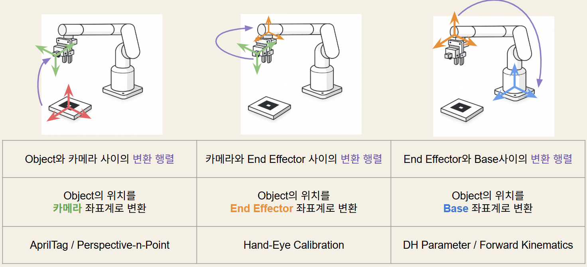

# MyCobot 280 — AprilTag 기반 Pick and Place (ROS2)

> **에드인에듀 「ROS2와 AI를 활용한 자율주행/로봇팔 부트캠프」** 팀 프로젝트
> Team Repository: https://github.com/addinedu-roscamp-5th/roscamp-repo-3.git

## 1. 프로젝트 개요

로봇팔 **MyCobot 280**의 손목(End-Effector)에 카메라를 달고, 카메라로 **AprilTag**를 인식해 물체의 위치를 알아낸 뒤 로봇팔이 물체를 집어 옮기는 **Pick and Place**를 구현했다.

### 해결해야 할 핵심 문제

카메라가 알려주는 태그 위치는 **카메라 기준** 좌표다.
하지만 로봇팔을 움직이려면 **로봇 베이스 기준** 좌표가 필요하다.

따라서 "카메라 기준 위치 → 베이스 기준 위치"로 바꾸는 것이 이 프로젝트의 핵심이며, 이를 아래 **3단계 좌표 변환**으로 해결했다.



| 단계 | 구하는 변환 | 결과 | 사용한 방법 |
|:---:|:---|:---|:---|
| 1 | 태그 → 카메라 | 태그 위치를 **카메라** 좌표계로 표현 | AprilTag / PnP |
| 2 | 카메라 → End-Effector | 태그 위치를 **End-Effector** 좌표계로 표현 | Hand-Eye Calibration |
| 3 | End-Effector → 베이스 | 태그 위치를 **베이스** 좌표계로 표현 | DH Parameter / Forward Kinematics |

---

## 2. 표기법

이 문서에서는 좌표계 사이의 관계를 **4×4 동차 변환 행렬(homogeneous transformation matrix)** 로 표현한다.

$$
T_{A}^{B} =
\begin{bmatrix}
R & t \\
0 & 1
\end{bmatrix}
$$

- $T_{A}^{B}$ : **A 좌표계로 표현된 점을 B 좌표계로 바꿔주는** 변환
- $R$ (3×3) : 회전, $t$ (3×1) : 평행이동
- 변환은 곱해서 이어 붙일 수 있다: $T_{A}^{C} = T_{B}^{C} \cdot T_{A}^{B}$

회전과 평행이동을 하나의 행렬로 묶기 때문에, 여러 단계의 변환을 **행렬 곱 하나로** 연결할 수 있다는 것이 이 표기법을 쓰는 이유다.

---

## 3. 단계 1 — 태그 → 카메라 ($T_{\text{tag}}^{\text{cam}}$)

### 목적
카메라 이미지에 찍힌 태그가 **카메라로부터 어디에, 어떤 방향으로** 놓여 있는지 계산한다.

### 원리: PnP (Perspective-n-Point)
PnP는 "**3D 좌표를 알고 있는 점들**"과 "**그 점들이 이미지에 찍힌 2D 위치**"를 비교해 물체의 3D 위치·자세를 역으로 계산하는 문제다.

AprilTag는 이 문제에 잘 맞는다.
- 태그의 실제 한 변 길이를 알고 있으므로 **네 꼭짓점의 3D 좌표**를 알 수 있다.
- 태그 검출기가 이미지에서 **네 꼭짓점의 2D 픽셀 좌표**를 찾아준다.

| 입력 | 의미 |
|:---|:---|
| Object points | 태그 꼭짓점의 3D 좌표 (태그 좌표계 기준, 태그 크기로 결정) |
| Image points | 이미지에서 검출된 꼭짓점의 2D 픽셀 좌표 |
| Camera matrix | 카메라 내부 파라미터 (초점거리, 주점) — 카메라 캘리브레이션으로 획득 |
| Distortion coefficients | 렌즈 왜곡 계수 |

| 출력 | 의미 |
|:---|:---|
| `rvec` | 태그의 회전 (Rodrigues 벡터, `cv2.Rodrigues`로 3×3 행렬로 변환) |
| `tvec` | 카메라 원점에서 태그 중심까지의 평행이동 |

`rvec`, `tvec`를 합치면 $T_{\text{tag}}^{\text{cam}}$이 된다.

```python
import cv2
retval, rvec, tvec = cv2.solvePnP(objectPoints, imagePoints, cameraMatrix, distCoeffs)
R, _ = cv2.Rodrigues(rvec)   # 회전 벡터 → 3x3 회전 행렬
```

> **참고:** 실제 코드에서는 `solvePnP`를 직접 호출하지 않았다. AprilTag 검출 라이브러리가 태그 크기와 카메라 파라미터를 받아 **내부적으로 같은 원리로 태그의 자세(pose)를 계산**해 주기 때문이다.

---

## 4. 단계 2 — 카메라 → End-Effector ($T_{\text{cam}}^{\text{gripper}}$)

### 목적
카메라는 그리퍼에 고정되어 있지만, **정확히 어디에 어떤 각도로** 붙어 있는지는 모른다. 이 고정된 상대 위치를 구하는 과정이 **Hand-Eye Calibration**이다.
(카메라가 로봇 손에 달린 이 구성을 **Eye-in-Hand** 방식이라 한다.)

### 원리: $AX = XB$
태그를 바닥에 고정해 두고, 로봇을 여러 자세로 움직이며 각 자세에서 두 가지를 기록한다.

1. **로봇이 아는 것**: Forward Kinematics로 계산한 그리퍼의 자세 ($T_{\text{gripper}}^{\text{base}}$)
2. **카메라가 본 것**: AprilTag로 측정한 태그의 자세 ($T_{\text{tag}}^{\text{cam}}$)

두 자세 사이에서 로봇이 움직인 양과 카메라에 보이는 태그가 움직인 양은 같은 움직임을 서로 다른 시점에서 본 것이다. 이 관계를 식으로 쓰면:

$$AX = XB$$

| 기호 | 의미 |
|:---:|:---|
| $A$ | 두 자세 사이에서 **그리퍼**가 움직인 상대 변환 (FK로 계산) |
| $B$ | 두 자세 사이에서 **카메라가 본 태그**의 상대 변환 (AprilTag로 측정) |
| $X$ | 카메라 ↔ 그리퍼 사이의 고정 변환 — **구하려는 값** |

자세를 여러 번 바꿔 데이터를 모으면 $X$를 풀 수 있다. OpenCV의 `calibrateHandEye`를 사용했다.

```python
import cv2

R_cam2gripper, t_cam2gripper = cv2.calibrateHandEye(
    R_gripper2base,  # 각 자세에서의 그리퍼→베이스 회전 행렬 리스트 (FK)
    t_gripper2base,  # 각 자세에서의 그리퍼→베이스 평행이동 리스트 (FK)
    R_target2cam,    # 각 자세에서의 태그→카메라 회전 행렬 리스트 (AprilTag)
    t_target2cam,    # 각 자세에서의 태그→카메라 평행이동 리스트 (AprilTag)
    method=cv2.CALIB_HAND_EYE_PARK
)
```

### 결과

```python
# Hand-Eye Calibration 결과: T_cam^gripper (평행이동 단위: mm)
X_matrix = np.array([
    [ 0.7039,  0.7102, -0.0089, -35.56],
    [-0.7100,  0.7033, -0.0347, -35.16],
    [-0.0184,  0.0307,  0.9994,   5.92],
    [ 0,       0,       0,        1.0 ]
])
```

**해석:** 왼쪽 위 3×3 회전 부분은 Z축 기준 약 **45° 회전**에 가깝고, 카메라는 그리퍼 원점에서 x, y 방향으로 각각 약 **35 mm** 떨어져 있다. 즉 카메라가 그리퍼 옆에 비스듬히 장착된 실제 구조와 일치한다.

---

## 5. 단계 3 — End-Effector → 베이스 ($T_{\text{gripper}}^{\text{base}}$)

### 목적
현재 관절 각도로부터 그리퍼가 **베이스 기준으로 어디에 있는지** 계산한다. 이것이 **Forward Kinematics(순기구학)** 이다.

### 원리: DH Parameters
DH(Denavit–Hartenberg) 표기법은 각 관절 사이의 관계를 **4개의 값만으로** 표준화해 표현하는 방법이다.

| 파라미터 | 의미 |
|:---:|:---|
| $\theta$ | 관절 회전 각도 (회전 관절에서 변하는 값) |
| $d$ | 이전 관절 축(z)을 따라 이동한 거리 |
| $a$ | 공통 법선(x)을 따라 잰 링크 길이 |
| $\alpha$ | 링크의 꼬임 각도 (x축 기준, 두 관절 축 사이의 각도) |

각 관절 $i$의 변환 행렬은 다음과 같다.

$$
T_i = \text{Rot}_z(\theta_i)\,\text{Trans}_z(d_i)\,\text{Trans}_x(a_i)\,\text{Rot}_x(\alpha_i)
$$

6개 관절의 행렬을 순서대로 곱하면 베이스에서 그리퍼까지의 변환이 된다.

$$
T_{\text{gripper}}^{\text{base}} = T_1 T_2 T_3 T_4 T_5 T_6
$$

### MyCobot 280 DH Parameters

```python
# 길이 단위: mm, 각도 단위: rad
d_vals     = [131.22,  0,       0,     63.4,    75.05,   45.6]
a_vals     = [0,      -110.4,  -96,    0,       0,       0   ]
alpha_vals = [1.5708,  0,       0,     1.5708, -1.5708,  0   ]
offsets    = [0,      -1.5708,  0,    -1.5708,  1.5708,  0   ]
# 실제 θ_i = (모터가 읽은 관절 각도 q_i) + offsets[i]
```

`offsets`는 로봇의 "0도 자세"와 DH 모델의 "0도 자세"가 다르기 때문에 그 차이를 보정하는 값이다.

---

## 6. 최종 좌표 변환

세 단계를 곱해 연결하면, 태그 위치를 베이스 좌표계로 바꿀 수 있다.

$$
P_{\text{base}} = T_{\text{gripper}}^{\text{base}} \cdot T_{\text{cam}}^{\text{gripper}} \cdot T_{\text{tag}}^{\text{cam}} \cdot P_{\text{tag}}
$$

| 항 | 의미 | 얻는 방법 |
|:---|:---|:---|
| $P_{\text{tag}}$ | 태그 좌표계 기준의 점 (태그 중심이면 $[0,0,0,1]^T$) | — |
| $T_{\text{tag}}^{\text{cam}}$ | 태그 → 카메라 | AprilTag / PnP (매 프레임 측정) |
| $T_{\text{cam}}^{\text{gripper}}$ | 카메라 → 그리퍼 | Hand-Eye Calibration (한 번 구해 고정) |
| $T_{\text{gripper}}^{\text{base}}$ | 그리퍼 → 베이스 | Forward Kinematics (현재 관절 각도로 계산) |
| $P_{\text{base}}$ | **베이스 기준 태그 위치 → 로봇팔의 목표 위치** | — |

오른쪽부터 읽으면 "태그 → 카메라 → 그리퍼 → 베이스" 순서로 좌표계를 하나씩 옮겨가는 과정이다.

---

## 7. ROS2 기반 Pick and Place

계산한 베이스 좌표를 목표로 ROS2에서 로봇팔을 제어했다.
통신은 **Service** 방식을 사용했다. Pick·Place는 "요청 → 동작 완료 → 결과 응답"이 한 쌍으로 끝나는 작업이므로, 응답을 받고 나서 다음 동작을 진행할 수 있는 Service 구조가 적합하다.

<table>
    <tr>
        <td align="center"></td>
        <td align="center"></td>
        <td align="center"></td>
        <td align="center"></td>
    </tr>
    <tr>
        <td align="center">Arm 1: Shelf → Buffer</td>
        <td align="center">Arm 1: Buffer → Shelf</td>
        <td align="center">Arm 2: Mobile Robot → Buffer</td>
        <td align="center">Arm 2: Buffer → Mobile Robot</td>
    </tr>
</table>
